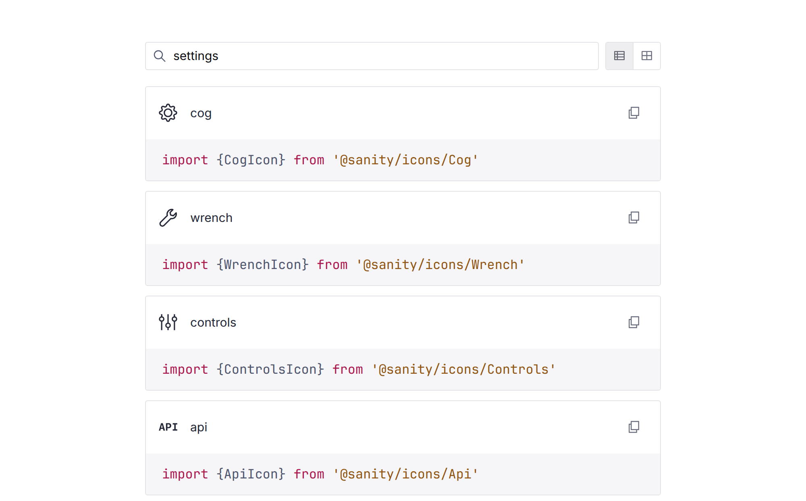
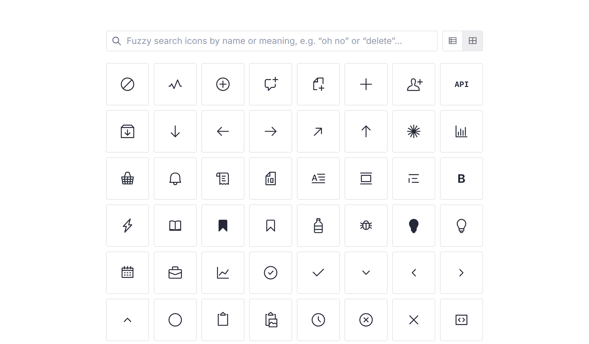

# @sanity/icons

The Sanity icons.

```sh
npm install @sanity/icons

# Install peer dependencies (requires React 18 or newer)
npm install react
```

[](https://www.npmjs.com/package/@sanity/icons)

## Finding the right icon

**[icons.sanity.dev](https://icons.sanity.dev)** is the searchable catalog of the full icon set.
The search matches meaning, not just names, so you don't need to know what an icon is called or
how it's spelled – searching “settings” surfaces `cog`, `wrench`, and `controls`, each with a
copyable import snippet:

[](https://icons.sanity.dev/?query=settings)

The grid view shows the whole set at a glance:

[](https://icons.sanity.dev/?view=grid)

## Usage

Every icon is published on its own export path. The subpath is the icon's name **without** the
`Icon` suffix, e.g. `RocketIcon` lives at `@sanity/icons/Rocket`. Importing icons this way keeps
bundles small and treeshaking fast, since your bundler skips parsing and resolving the full icon
set to reach the handful of icons you actually use:

```jsx
import {RocketIcon} from '@sanity/icons/Rocket'

function App () {
  return <RocketIcon style={{fontSize: 72}}>
}
```

Each icon is also the module's default export, which makes lazy-loading a single icon easy:

```jsx
import {lazy} from 'react'

const RocketIcon = lazy(() => import('@sanity/icons/Rocket'))
```

### Dynamic icons

The root entry exposes the dynamic `<Icon>` component, the `icons` map, and their types – and
nothing else. Individual icons are not re-exported from the root (these barrel exports were
deprecated in v4 and removed in v5): import them from their subpath as shown above. If you
import an icon from the root anyway, the import still fails to resolve at runtime, but the
types resolve to a `@deprecated` `never`-typed tombstone whose message points at the subpath
the icon lives on – so a moved icon is not mistaken for a deleted one.

Every entry in the `icons` map is a `React.lazy` component over the icon's subpath module, so
importing the root entry pulls no icon code into your bundle – each icon is fetched as its own
chunk the first time it renders.

`<Icon>` wraps the lazy icon in a `<Suspense>` boundary whose fallback is an svg with the same
viewBox and dimensions (but no drawing content yet), so the icon slot reserves its final size
immediately and the graphic pops in once loaded – the way an `` with intrinsic dimensions
loads:

```jsx
import {Icon} from '@sanity/icons'

function App() {
  return <Icon symbol="rocket" style={{fontSize: 72}} />
}
```

When rendering components from the `icons` map directly, provide your own `<Suspense>` boundary:

```jsx
import {icons} from '@sanity/icons'
import {Suspense} from 'react'

function App(props) {
  const IconComponent = icons[props.symbol]

  return (
    <Suspense fallback={null}>
      <IconComponent />
    </Suspense>
  )
}
```

## License

MIT-licensed. See LICENSE.
